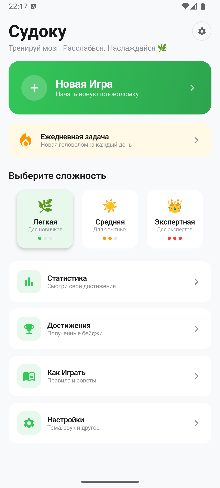
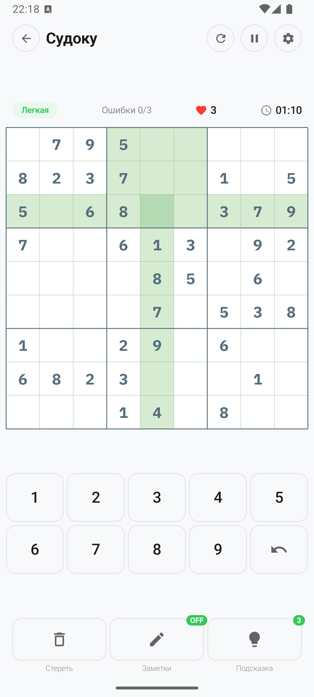
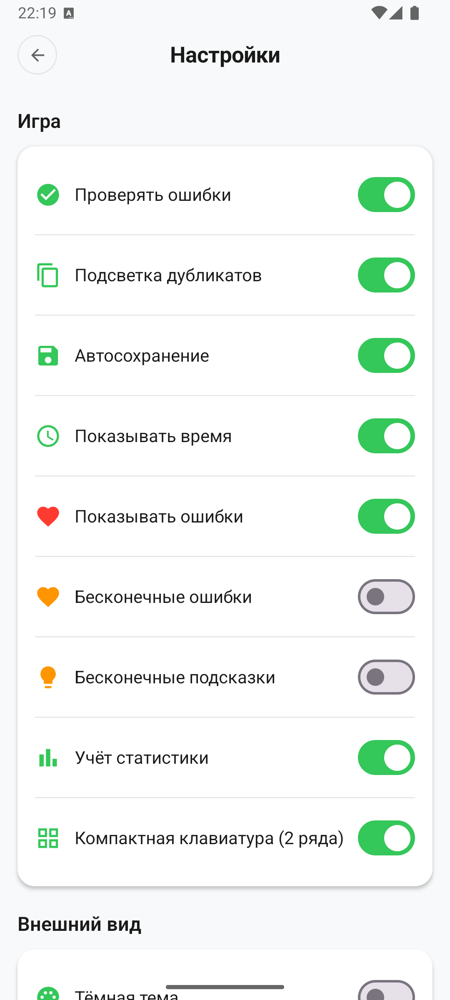
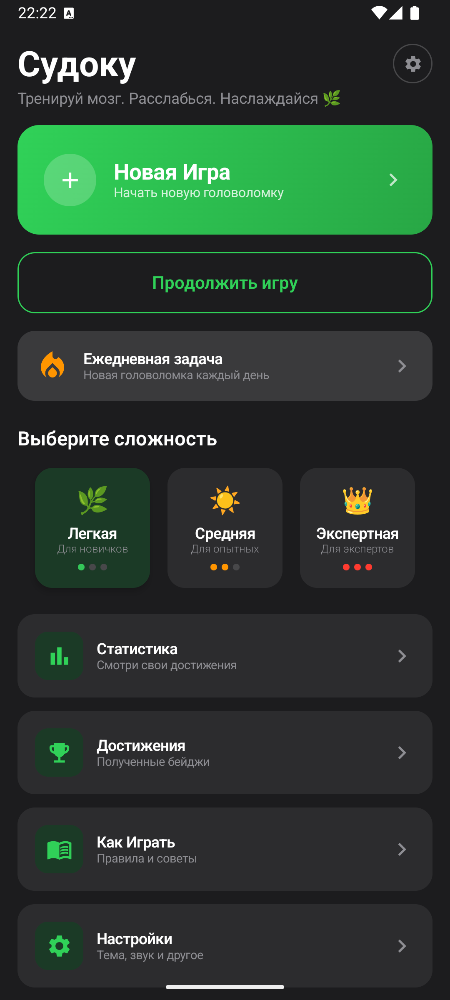
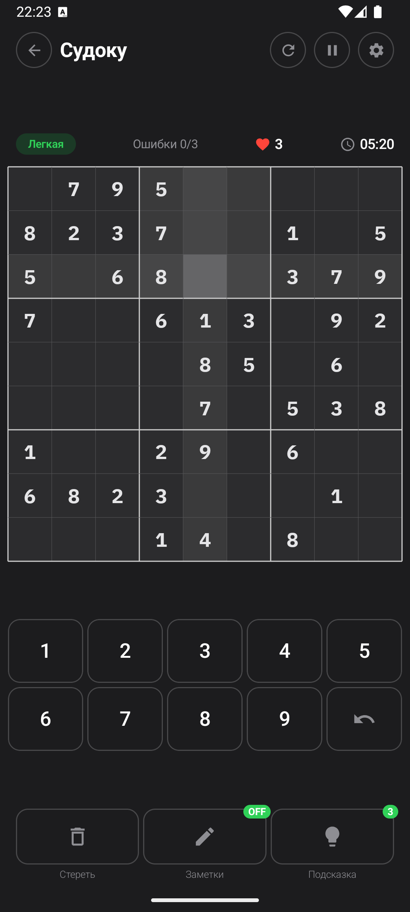
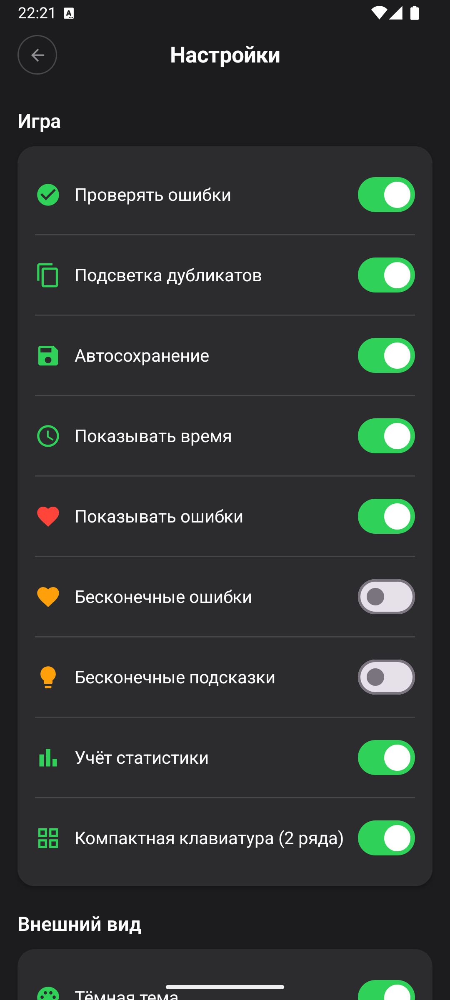

# Sudoku

Мобильная головоломка Судоку для Android.

[](https://play.google.com/store/apps/details?id=ru.shprot.sudokumobdevkz)
[](https://github.com/shprotx/SudokuMobDevKZ/releases/latest)

## Особенности

- 3 уровня сложности (лёгкий, средний, экспертный)
- Светлая и тёмная темы
- Подробная статистика с онлайн-перцентилями (Firebase)
- Стандартный и упрощённый режимы игры
- Заметки с автоматическим пересчётом при заполнении ячеек
- Подсветка одинаковых цифр и заметок
- Подсказки, отмена хода, пауза с сокрытием поля
- Автосохранение — продолжайте партию после выхода
- Полностью израсходованные цифры скрываются
- Локализация: EN / RU / KK

## Стек

- **Kotlin** 100%
- **Jetpack Compose** + Material3
- **MVI** (BaseViewModel + UIState / UIEvent / UIEffect)
- **Hilt** — DI
- **Room** — локальная БД
- **DataStore** — настройки
- **Retrofit** + KotlinX Serialization — Firebase REST API
- **Navigation Compose** — type-safe routes
- **Coroutines + Flow**
- **CI/CD**: GitHub Actions (автосборка релизного APK при мерже в master)

## Архитектура

Feature-based Clean Architecture:

```
core/
├── base/data/         — БД, API, репозитории
├── base/domain/       — модели, генератор судоку (Dancing Links)
├── base/presentation/ — BaseViewModel, MVI-контракты
├── theme/             — AppTheme (цвета, типографика, размеры)
└── uicommon/          — переиспользуемые UI-компоненты
feature/
├── game/              — игровой экран
├── menu/              — главное меню
├── statistic/         — статистика
├── settings/          — настройки + политика конфиденциальности
├── gameover/          — экран результата
├── howtoplay/         — как играть
└── splash/            — сплеш с анимацией
```

## Скриншоты

Светлая тема:

<p float="left">
  
  
  
</p>

Тёмная тема:

<p float="left">
  
  
  
</p>

## Сборка

```bash
./gradlew assembleDebug      # Debug APK
./gradlew assembleRelease    # Release APK (нужен keystore в local.properties)
```

Release-подпись: `KEYSTORE_FILE`, `KEYSTORE_PASS`, `KEYSTORE_ALIAS`, `KEYSTORE_ALIAS_PASS` в `local.properties` или env.
