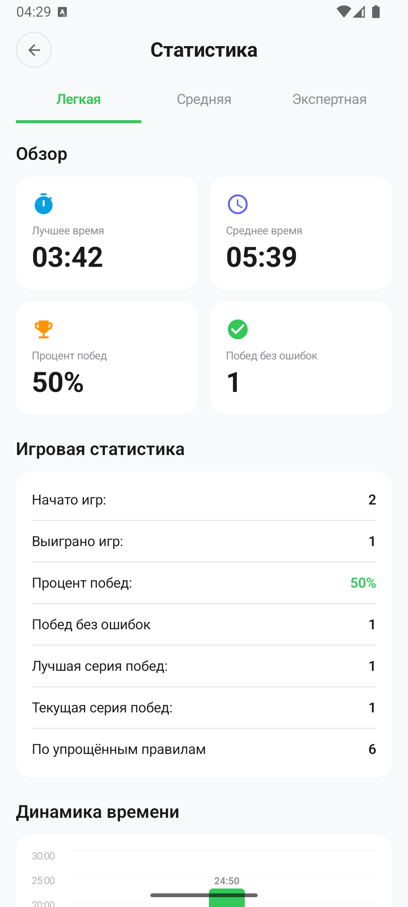
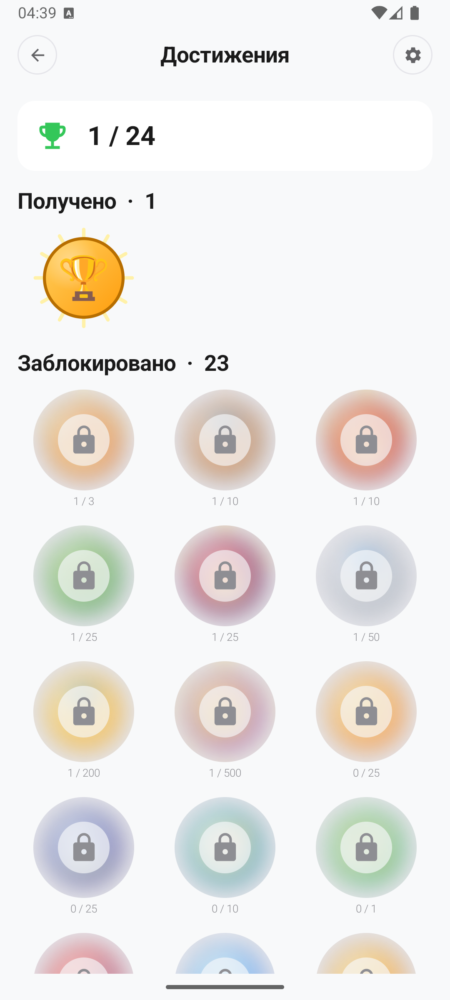

# Sudoku

Мобильная головоломка Судоку для Android — без рекламы, без покупок, с Google Play Games, облачным сохранением и онлайн-рейтингом.

[](https://play.google.com/store/apps/details?id=ru.shprot.sudokumobdevkz)
[](https://github.com/shprotx/SudokuMobDevKZ/releases/latest)
[](LICENSE)

## Особенности

### Игра
- 3 уровня сложности: лёгкий, средний, экспертный
- Стандартный (с ограничением ошибок) и упрощённый (casual) режимы
- Ежедневный челлендж с серией дней подряд (текущая + лучшая)
- Заметки с автопересчётом при заполнении ячеек
- Подсветка одинаковых цифр и заметок
- Подсказки, отмена хода, пауза с сокрытием поля
- Автосохранение — продолжайте партию после выхода
- Полностью использованные цифры скрываются
- Компактная двухрядная клавиатура для маленьких экранов

### Google Play Games
- Глобальный Топ-10 игроков с аватарками
- Единая формула рейтинга: сложность × время × ошибки × подсказки × дейли
- 24+ достижения, синхронизация через PGS
- Облачное сохранение всего прогресса (статистика, ачивки, дейли-стрики, saved game)
- Авто-восстановление прогресса при входе под тем же Google-аккаунтом на новом устройстве

### Статистика
- Подробная стата по каждой сложности: лучшее время, среднее, % побед, серии
- Онлайн-перцентиль игрока на фоне всех пользователей (Firebase)
- График динамики времени с округлением вверх
- Streak-бейджи в стиле дейлика

### UX / Темы
- Светлая и тёмная темы
- Edge-to-edge UI, поддержка Android 15/16
- Мгновенные переходы между экранами
- Локализация: EN / RU / KK

## Стек

- **Kotlin** 100%
- **Jetpack Compose** + Material3
- **MVI** (BaseViewModel + UIState / UIEvent / UIEffect)
- **Hilt** — DI
- **Room** — локальная БД
- **DataStore** — настройки
- **Retrofit** + KotlinX Serialization — Firebase REST API
- **Navigation Compose** — type-safe routes
- **Coroutines + Flow**
- **Google Play Games SDK** — sign-in, achievements, leaderboards, snapshots
- **gradle-play-publisher** (Triple-T) — автозаливка в Play Console
- **CI/CD**: GitHub Actions — авто-сборка release APK при мерже в master

## Архитектура

Feature-based Clean Architecture:

```
core/
├── base/data/         — БД, API, репозитории, PGS-cloud, sync
├── base/domain/       — модели, генератор (Dancing Links), use cases
├── base/presentation/ — BaseViewModel, MVI-контракты
├── theme/             — AppTheme (цвета, типографика, размеры)
└── uicommon/          — переиспользуемые UI-компоненты
feature/
├── game/              — игровой экран
├── menu/              — главное меню
├── statistic/         — статистика
├── achievements/      — ачивки
├── leaderboards/      — Топ-10 экран
├── dailychallenge/    — ежедневная задача
├── settings/          — настройки + cloud import + privacy policy
├── gameover/          — экран результата
├── howtoplay/         — как играть
└── splash/            — сплеш с анимацией
```

## Скриншоты

<p float="left">
  
  
  
  
  
</p>

## Сборка

```bash
./gradlew assembleDebug          # Debug APK
./gradlew assembleRelease        # Release APK (нужен keystore в local.properties)
./gradlew bundleRelease          # Release AAB для загрузки в Play Console
./gradlew publishReleaseBundle   # Залить AAB в Play Console (Triple-T plugin)
./gradlew testDebugUnitTest      # Юнит-тесты
```

`local.properties` (НЕ коммитится):
```
KEYSTORE_FILE=path/to/keystore.jks
KEYSTORE_PASS=...
KEYSTORE_ALIAS=...
KEYSTORE_ALIAS_PASS=...
FIREBASE_DB_URL=https://...firebaseio.com
PLAY_SERVICE_ACCOUNT_FILE=path/to/service-account.json
```

## Релизный процесс

Версионирование, треки Play Console, команды публикации, hotfix-flow и промоут internal → production — см. [docs/release-process.md](docs/release-process.md).

## Лицензия

Source-available, non-commercial, no-republish — см. [LICENSE](LICENSE).
